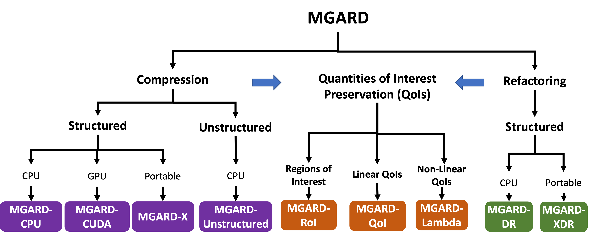

 

[![build status][push workflow badge]][push workflow] [![format status][format workflow badge]][format workflow]

MGARD (MultiGrid Adaptive Reduction of Data) is a technique for multilevel lossy compression and refactoring of scientific data based on the theory of multigrid methods.
We encourage you to [make a GitHub issue][issue form] if you run into any problems using MGARD, have any questions or suggestions, etc.

[push workflow]: https://github.com/CODARcode/MGARD/actions/workflows/build.yml
[push workflow badge]: https://github.com/CODARcode/MGARD/actions/workflows/build.yml/badge.svg
[format workflow]: https://github.com/CODARcode/MGARD/actions/workflows/format.yml
[format workflow badge]: https://github.com/CODARcode/MGARD/actions/workflows/format.yml/badge.svg
[issue form]: https://github.com/CODARcode/MGARD/issues/new/choose

MGARD framework consists of the following modules. Please see the detailed instructions for each module to build and install MGARD.

## `MGARD-CPU`: MGARD implementation for CPUs
MGARD-CPU is design for running compression on CPUs. See detailed user guide in [here][mgard-cpu]

[mgard-cpu]: doc/MGARD-CPU.md

## `MGARD-CUDA`: CUDA accelerated compression
MGARD-CUDA is designed for accelerating compression specifically using NVIDIA GPUs. See detailed user guide in [here][gpu instructions].

[gpu instructions]: doc/MGARD-GPU.md

## `MGARD-X`: Accelerated and portable compression
MGARD-X is designed for portable compression on NVIDIA GPUs, AMD GPUs, and CPUs. See detailed user guide in [here][mgard_x instructions].

[mgard_x instructions]: doc/MGARD-X.md

## `MGARD-DR`/`MGARD-XDR`: Fine-grain progressive data reconstruction
MGARD-DR and MGARD-XDR are designed for enabling fine-grain data refactoring and progressive data reconstruction. See detailed user guide in [here][mdr_x instructions].

[mdr_x instructions]: doc/MDR-X.md

## `MGARD-ROI`: Preserving Region-of-Interest
MGARD-ROI is designed for preserving region-of-interest during data compression. See detailed user guide in [here][mgard-roi].

[mgard-roi]: doc/MGARD-RoI.md

## `MGARD-QOI`: Preserving Linear Quantity-of-Interest
MGARD-QOI is designed for preserving linear quantity-of-interest during data compression. See detailed user guide in [here][mgard-qoi].

[mgard-qoi]: doc/MGARD-QoI.md

## `MGARD-Lambda`: Preserving Non-Linear Quantity-of-Interest
MGARD-Lambda is designed for preserving non-linear quantity-of-interest during data compression. This is an experimental part of MGARD. Currently only support certain QoIs derived from XGC 5D data. See theory in [here][mgard-lambda-theory] and example in [here][mgard-lambda].

[mgard-lambda-theory]: doc/images/post-processing.pdf
[mgard-lambda]: ./examples/lambda

## Self-describing format for compressed and refactored data
Data produced by MGARD, MGARD-X, and MDR-X are designed to follow a unified self-describing format. See format details in [here][mgard format].

[mgard format]: doc/MGARD-format.md

## Publications

### Fundamental Theory
* Xin Liang et al. [MGARD+: Optimizing Multilevel Methods for Error-bounded Scientific Data Reduction.][mgard+] *IEEE Transactions on Computers*, 2021
* Mark Ainsworth et al. [Multilevel Techniques for Compression and Reduction of Scientific Data—The Unstructured Case.][unstructured] *SIAM Journal on Scientific Computing*, 42 (2), A1402–A1427, 2020.
* Mark Ainsworth et al. [Multilevel Techniques for Compression and Reduction of Scientific Data—Quantitative Control of Accuracy in Derived Quantities.][quantities] *SIAM Journal on Scientific Computing* 41 (4), A2146–A2171, 2019.
* Mark Ainsworth et al. [Multilevel Techniques for Compression and Reduction of Scientific Data—The Multivariate Case.][multivariate] *SIAM Journal on Scientific Computing* 41 (2), A1278–A1303, 2019.
* Mark Ainsworth et al. [Multilevel Techniques for Compression and Reduction of Scientific Data—The Univariate Case.][univariate] *Computing and Visualization in Science* 19, 65–76, 2018.
* Ben Whitney. [Multilevel Techniques for Compression and Reduction of Scientific Data.][thesis] PhD thesis, Brown University, 2018.

### Preserving Quantites of Interest (QoIs)
* Tania Banerjee et al. [Scalable Hybrid Learning Techniques for Scientific Data Compression.][pp3], *Arxiv*, 2022
* Qian Gong et al. [Region-adaptive, Error-controlled Scientific Data Compression using Multilevel Decomposition.][roi2] *the 34th International Conference on Scientific and Statistical Database Management*, Jul. 2022
* Tania Benerjee et al. An algorithmic and software pipeline for very large scale scientific data compression with error guarantees. *International Conference on High Performance Computing, Data, and Analytics*, 2022
* Jaemoon Lee et al. [Error-bounded learned scientific data compression with preservation of derived quantities.][pp] *Applied Sciences*, 2022
* Qian Gong et al. [Maintaining trust in reduction: Preserving the accuracy of quantities of interest for lossy compression.][roi] *21st Smoky Mountains Computational Sciences and Engineering Conference*, Oct. 2021

### Pregressive Retrieval
* Jinzheng Wang et al. Improving Progressive Retrieval for HPC Scientific Data using Deep Neural Network. *IEEE International Conference on Data Engineering (ICDE)*, 2023 
* Xin Liang et al. [Error-controlled, progressive, and adaptable retrieval of scientific data with multilevel decomposition.][mdr] *the International Conference for High Performance Computing, Networking, Storage and Analysis 2021*, Nov, 2021

### Parallelization and GPU Acceleration
* Jieyang Chen et al. [Scalable Multigrid-based Hierarchical Scientific Data Refactoring on GPUs.][gpu2] *Arxiv*
* Jieyang Chen et al. [Accelerating Multigrid-based Hierarchical Scientific Data Refactoring on GPUs.][gpu] *35th IEEE International Parallel & Distributed Processing Symposium*, May 17–21, 2021.

### System Optimizations
* Lipeng Wan et al. RAPIDS: Reconciling Availability, Accuracy, and Performance in Managing Geo-Distributed Scientific Data. *the International ACM Symposium on High-Performance Parallel and Distributed Computing*, Jun. 2023
* Xinying Wang et al. [Unbalanced Parallel I/O: An Often-Neglected Side Effect of Lossy Scientific Data Compression.][unbalanced-io] *7th International Workshop on Data Analysis and Reduction for Big Scientific Data*, Nov. 2021

[thesis]: https://doi.org/10.26300/ya1v-hn97
[univariate]: https://doi.org/10.1007/s00791-018-00303-9
[multivariate]: https://doi.org/10.1137/18M1166651
[quantities]: https://doi.org/10.1137/18M1208885
[unstructured]: https://doi.org/10.1137/19M1267878
[gpu]: https://ieeexplore.ieee.org/abstract/document/9460526/
[gpu2]: https://arxiv.org/abs/2105.12764
[mgard+]: https://ieeexplore.ieee.org/abstract/document/9479913/
[unbalanced-io]: https://ieeexplore.ieee.org/abstract/document/9652573/
[mdr]: https://dl.acm.org/doi/abs/10.1145/3458817.3476179
[roi]: https://link.springer.com/chapter/10.1007/978-3-030-96498-6_2
[roi2]: https://dl.acm.org/doi/abs/10.1145/3538712.3538717
[pp]: https://www.mdpi.com/1709018 
[pp3]: https://arxiv.org/abs/2212.10733

