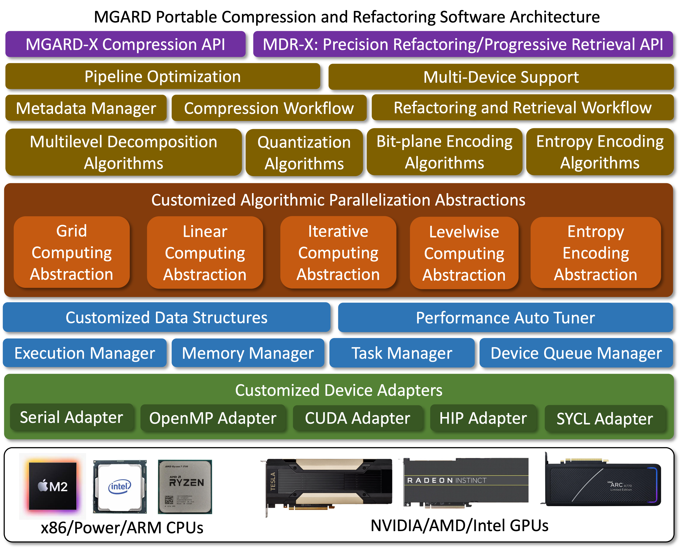
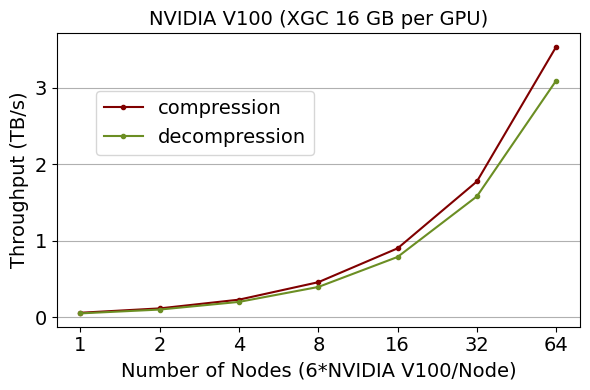
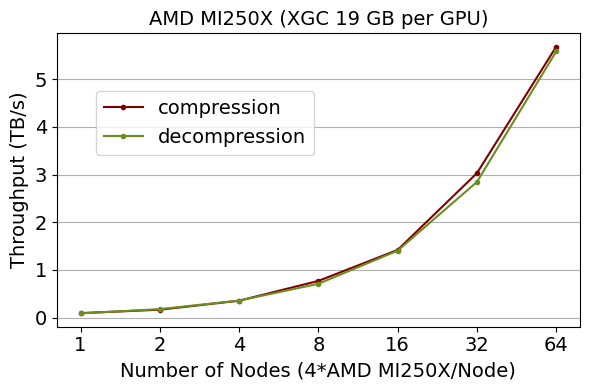

# MGARD-X

MGARD-X is a portable implementation of the MGARD lossy compressor supporting various types of GPUs and CPUs.

[](MGARD-X)

## Supporting features
* **Data type:** Double and single precision floating-point data
* **Dimensions:** 1D-5D
* **Error-bound type:** L\_Inf error and L\_2 error
* **Error-bound mode:** Absoluate and relative
* **Data structure:** Uniform and non-uniform spaced Cartisan gird

## Portability
|Hardware|Portability|Tested processors|
|---|---|---|
|x86 CPUs|Yes|Intel CPUs, AMD CPUs|
|Power CPUs|Yes|IMB Power9 CPUs|
|ARM CPUs|Yes|Apple M2|
|NVIDIA GPUs|Yes*|V100, RTX2080 Ti, RTX 3090|
|AMD GPUs|Yes|MI-100, MI-250X|
|Intel GPUs|Yes|Gen9|
|Integrated GPUs|Yes|Gen9|

*LZ4 lossless compressor is only avaialble to choose on NVIDIA GPUs. Portable version is under development.

## Interfaces

* **Command Line Inteface:** Full-featured command line executable for compression/decompression. 
* **High-level APIs:** Encapsulated all GPU-related details for easiest integration with user's program. Also, compressing metadata is being handled internally.
* **Low-level APIs:** Users can fully control different steps of compression (the preprocessing step, GPU buffers allocations, GPU compression kernel invokation, GPU-CPU data copy) for more fexiable and higher performance compression. Compressing metadata needs to be managed by users.

  

## Software requirements
### For CPUs

* GCC 7.5.0+ (x86, Power)
* Clang 14+ (Apple silicon)
* CMake 3.19+

### For Multi-core CPUs

* GCC 7.5.0+ (x86, Power)
* Clang 14+ (Apple silicon)
* OpenMP 3.1+
* CMake 3.19+

### For NVIDIA GPUs

* CUDA 11.0+ or NVIDIA HPC 22.0+
* CMake 3.19+

### For AMD GPUs

* ROCm 4.5.0+
* CMake 3.21+

### For Intel GPUs

* DPC++/SYCL 2022+
* CMake 3.21+


## Software dependencies 
* [NVCOMP v2.2.0][nvcomp] (for NVIDIA GPUs only)
* [ZSTD v1.5.0][zstd]
* [Protobuf v3.19.4][protobuf]

[nvcomp]: https://github.com/NVIDIA/nvcomp.git
[zstd]: https://github.com/facebook/zstd.git
[protobuf]: https://github.com/protocolbuffers/protobuf.git
## Configure and build
* **Option 1:** One-step configure and build scripts are available [here][build_scripts].
* **Option 2:** Manually confiugre and build with CMake

[build_scripts]:../build_scripts
	
|CMake options|Value|Default|Description|
|---|---|---|---|
|MGARD\_ENABLE\_SERIAL|ON/OFF|ON|Enable portable serial compression/decompression on CPUs|
|MGARD\_ENABLE\_OPENMP|ON/OFF|OFF|Enable portable multi-threaded compression/decompression on CPUs|
|MGARD\_ENABLE\_CUDA|ON/OFF|OFF|Enable portable GPU compression/decompression with CUDA on NVIDIA GPUs|
|MGARD\_ENABLE\_HIP|ON/OFF|OFF|Enable portable GPU compression/decompression with HIP on AMD GPUs|
|MGARD\_ENABLE\_SYCL|ON/OFF|OFF|Enable portable GPU compression/decompression with SYCL on Intel GPUs|
|MGARD\_ENABLE\_MULTI_DEVICE|ON/OFF|OFF|Enable multi-device (GPUs) compression/decompression|
|MGARD\_ENABLE\_COORDINATE\_NORMALIZATION|ON/OFF|ON|Enable coordinate normalization|
|MGARD\_ENABLE\_AUTO\_TUNING|ON/OFF|OFF|Enable auto tuning feature|
|MGARD\_ENABLE\_MDR|ON/OFF|OFF|Enable building MDR and MDR-X|

## Control Errors
MGARD can bound errors in various types of norm:

* To bound ***L<sup>&infin;</sup> norm***, the ```s``` smoothness parameter needs to be set to `infinity`.
* To bound ***L<sup>2</sup> norm***, the ```s``` smoothness parameter needs to be set to `0`.
* To bound ***L<sup>s</sup> norm***, the ```s``` smoothness parameter needs to be set to `s`.

MGARD can bound error `tol` in two ways (using L<sup>&infin;</sup> norm as an example, `u` is original data, `u'` is decompressed data):

* ***Absolute*** error mode can guarantee ***| u - u' |<sub>&infin;</sub> < tol***
* ***Relative*** error mode can guarantee ***| u - u' |<sub>&infin;</sub> < tol * | u |<sub>&infin;</sub>***


## Using command line interface (CLI)
An executable ```mgard-x``` will be built after building the MGARD-X library. To use the ```mgard-x``` CLI, here are the options:

+ ```-z```: enable compression mode
    + ```-i <path>``` path to data file to be compressed
    + ```-c <path>``` path to compressed file
    + ```-t <s|d>``` data type (s: single | d:double)
    + ```-n <D>``` total number of dimensions
        + ```<n_1>``` slowest dimention
        + ```<n_2>``` 2nd slowest dimention
        + ...
        + ```<n_D>``` fastest dimention
    + ```-u <path>``` path to coordinate file (non-uniform only)
    + ```-m <abs|rel>``` error bound mode (abs: abolute | rel: relative)
    + ```-e <error>``` error bound
    + ```-s <smoothness>``` smoothness parameter
    + ```-r <0|1>``` internal data layout (0: Higher throughput | 1: Higher compression ratio)
    + ```-b <0|1>``` domain decomposition type (0: 1D max dimension (default) | 1: N-D block)
    + ```-f <bytes>``` maximum memory footprint in bytes (if not specify: no limit)
    + ```-l <0|1|2>``` choose lossless compressor (0:Huffman | 1:Huffman+LZ4 (NVIDIA GPU only) | 2:Huffman@ZSTD)
+ ```-x```: enable decompression mode
    + ```-c <path>``` path to compressed file
    + ```-o <path>``` path to decompressed file
+ ```-d <auto|serial|openmp|cuda|hip|sycl>``` choose processor (auto: Auto select | serial: CPU | openmp: multi-threaded CPU | cuda: NVIDIA GPU | hip: AMD GPU | sycl: Intel GPU )
+ ```-v``` enable verbose (0: error only (default) | 1: error + infomation | 2: error + timing | 3: all)
+ ```-g <G>``` number of devices (GPUs) to use (default: 1)
+ ```-h <0|1>``` enable/disable prefecth pipeline optimization (0: disable | 1: enable (default))

	
## For using both the high-level APIs and low-level API
* **Include the header file.**
    + Use ```mgard/compress_x.hpp``` for ***high-level*** compression/decompression APIs
    + Use ```mgard/compress_x_lowlevel.hpp``` for ***low-level*** compression/decompression APIs
* **Configure using ```mgard_x::Config```** Both high-level APIs and low-level APIs have an optional parameter for users to configure the compression/decomrpession process via ```mgard_x::Config``` class. To configure, create a ```mgard_x::Config``` object and configure its fields:
    + ```dev_type```: sepcifying the processor for compression/decompression:
        + ```mgard_x::device_type::Auto```: Auto detect the best processor (***Default***)
        + ```mgard_x::device_type::SERIAL```: Use CPUs (serial)
        + ```mgard_x::device_type::OPENMP```: Use CPUs (multi-threaded)
        + ```mgard_x::device_type::CUDA```: Use NVIDIA GPUs
        + ```mgard_x::device_type::HIP ```: Use AMD GPUs
        + ```mgard_x::device_type::SYCL ```: Use Intel GPUs
        
    + ```dev_id```: sepcifying a specific GPU to use in multi-GPU systems (***Default: 0***)
    + ```num_dev```: sepcifying the number of GPU to use in multi-GPU systems (***Default: 1***)
    + ```reorder```: sepcifying an internal data layout (0: Higher throughput | 1: Higher compression ratio) (***Default: 0***)
    + ```lossless```: control the lossless compression used: 
        + ```mgard_x::lossless_type::Huffman```: Huffman compression (***Default***)
        + ```mgard_x::lossless_type::Huffman_LZ4```: Huffman and LZ4 compression 
        + ```mgard_x::lossless_type::Huffman_Zstd```: Huffman and ZSTD compression
        + *Note:* there will be no effect configuring the lossless comrpessor for decompression as MGARD has to use the same lossless compressor that was used for compression.
    + ```huff_dict_size```: Huffman dictionary size (***Default: 8192***)
    + ```huff_block_size```: Huffman parallelized block size (***Default: 20480***)
    + ```lz4_block_size```: LZ4 parallelized block size (***Default: 32768***)
    + ```zstd_compress_level```: Zstd compression level (***Default: 3***)
    + ```normalize_coordinates```: enable or disable coordinate normalization (***Controlled by CMake option***)
    + ```domain_decomposition``` (for high-level APIs only): controls how data can be domain decomposed:
        + ```mgard_x::domain_decomposition_type::MaxDim```: 1D decomposition along the largest dimension  (***Default***)
        + ```mgard_x::domain_decomposition_type::Block```: N-D block based decomposition
    + ```decomposition```: controls multi-level decomposition:
        + ```mgard_x::decomposition_type::MultiDim```: N-D decomposition (***Default***)
        + ```mgard_x::decomposition_type::SingleDim```: 1D-at-a-time decomposition
    + ```max_larget_level```: controls max level of multi-level decomposition (***Default: 0 (no limit)***)
    + ```prefetch```(for high-level APIs only): controls whether or not to enable prefetch pipeline optimization (***Default: true***)
    + ```max_memory_footprint```(for high-level APIs only): controls maximum memory footprint in bytes (***Default: inf (no limit)***)
    + ```adjust_shape```(for high-level APIs only): controls whether or not to enable shape adjustment for better decomposition performance (***Default: false***)
## Using high-level APIs
* **For compression:** ```enum mgard_x::compress_status_type mgard_x::compress(mgard_x::DIM D, mgard_x::data_type dtype, std::vector<mgard_x::SIZE> shape, double tol, double s, enum error_bound_type mode, const void *original_data, void *&compressed_data, size_t &compressed_size, mgard_x::Config config)```
    + ```[In] shape:``` Shape of the Dataset to be compressed (from slowest to fastest).
    + ```[In] data_type:``` mgard_x::data_type::Float or mgard_x::data_type::Double.
    + ```[In] type:``` mgard_x::error_bound_type::REL or mgard_x::error_bound_type::ABS.
    + ```[In] tol:``` Error tolerance.
    + ```[In] s:``` Smoothness parameter.
    + ```[In] compressed_data:``` Dataset to be compressed.
    + ```[Out] compressed_size:``` Size of comrpessed data.
    + ```[In][Optional] coords:``` The coordinates in each dimension (from slowest to fastest).
    + ```[in][Optional] config:``` For configuring the compression process (optional).
    + ```[in] output_pre_allocated:``` Indicate whether or not the output buffer is pre-allocated. If not, MGARD will allocate the output buffer.
    + ```[Return]``` Compression status:
        + mgard_x::compress_status_type::Success
        + mgard_x::compress_status_type::Failure
        + mgard_x::compress_status_type::OutputTooLargeFailure
        + mgard_x::compress_status_type::NotSupportHigherNumberOfDimensionsFailure
        + mgard_x::compress_status_type::NotSupportDataTypeFailure
        + mgard_x::compress_status_type::BackendNotAvailableFailure

* **For decompression:** ```enum mgard_x::compress_status_type decompress(const void *compressed_data, size_t compressed_size, void *&decompressed_data, Config config)```
    + ```[In] compressed_data:``` Compressed data.
    + ```[In] compressed_size:``` Size of comrpessed data.
    + ```[Out] decompressed_data:``` Decompressed data.
    + ```[Out][Optional] shape:``` Shape of the decompressed data.
    + ```[Out][Optional] data_type:``` Data type of the decompressed data.
    + ```[In][Optional] config:``` For configuring the decompression process (optional).
    + ```[in] output_pre_allocated:``` Indicate whether or not the output buffer is pre-allocated. If not, MGARD will allocate the output buffer.
    + ```[Return]``` Compression status:
    	+ mgard_x::compress_status_type::Success
        + mgard_x::compress_status_type::Failure
        + mgard_x::compress_status_type::NotSupportHigherNumberOfDimensionsFailure
        + mgard_x::compress_status_type::NotSupportDataTypeFailure
        + mgard_x::compress_status_type::BackendNotAvailableFailure

## Using low-level APIs
* **Step 1: Build Hierarchy**
An object ```mgard_x::Hierarchy``` needs to be created and initialized. This builds the decomposition hierarchy for compression. It only needs to be created once if the input shape is not changed. For example, compressing the same variable on different timesteps only needs the Hierarchy object to be created once. Also, the same Hierarchy object can be reused in between compression and decompression.
    + ```mgard_x::Hierarchy<NumDims, DataType, Device_type>(std::vector<size_t> shape, std::vector<T*> coords, mgard_x::Config config)```.
        + ```[In] NumDims```: Total number of dimensions (1 - 5)
	+ ```[In] DataType```: Input data type (float or double)
        + ```[In] Device_type ```: The type of device used (mgard\_x::SERIAL, mgard\_x::OPENMP, mgard\_x::CUDA, mgard\_x::HIP, or mgard\_x::SYCL)
        + ```[In] shape```: Stores the size in each dimension (from slowest to fastest).
        + ```[In][Optional] coords```: The coordinates in each dimension (from slowest to fastest).
      	+ ```[In] config```: For configuring compression/decomrpession.
* **Step 2: Create Compressor** 
An object ```mgard_x::Compressor``` needs to be created and initialized. Same as ```mgard_x::Hierarchy```, it only needs to be created once if the input shape is not changed and it can be reused in between compression and decompression.
    + ```mgard_x::Compressor<NumDims, DataType, DeviceType>(mgard_x::Hierarchy<NumDims, DataType, Device_type> hierarchy, mgard_x::Config config)```.
        + ```[In] NumDims```: Total number of dimensions (1 - 5)
        + ```[In] DataType```: Input data type (float or double)
        + ```[In] Device_type ```: The type of device used (mgard\_x::SERIAL, mgard\_x::OPENMP, mgard\_x::CUDA, mgard\_x::HIP, or mgard\_x::SYCL)
        + ```[In] hierarchy```: A constructed hierarchy object.
        + ```[In] config```: For configuring compression/decomrpession.
* **Step 3: Use mgard_x::Array.** ```mgard_x::Array``` is used for holding a managed array on GPU or CPU.
    +  For ***creating*** an array. ```mgard_x::Array::Array<NumDims, DataType, Device_type>(std::vector<size_t> shape)``` creates an managed array on GPU or CPU with the shape of ```shape```.
    +  For ***loading data*** into an array. ```void mgard_x::Array::load(DataType *data, size_t ld = 0)``` copies ```data``` into the the managed array on the targeting processor. ```data``` can be on either on CPU or GPU. An optional ```ld``` can be provided for specifying the size of the leading dimension. Passing ```ld = 0``` indicates that the size of the leading dimension equals to the size of the fastest dimension.
    +  For ***accessing data from CPU*** ```DataType * mgard_x::Array::hostCopy(bool keep = false)``` returns a CPU pointer of the array. An optional flag ```keep``` can be use to indicates whether or not to keep memory allocation of host copy after the ```mgard_x::Array``` object is destructed.
    +  For ***accessing data from GPU***```DataType * mgard_x::Array::data(size_t &ld)``` returns a pointer of the array on the targeting processor.
    +  For ***getting the shape*** of an array. ```mgard_x::SIZE mgard_x::Array::shape(<dimension>)``` returns the size of a specified dimension of the managed array.

   ***Note:*** ```mgard_x::Array``` will automatically release its internal CPU/GPU array when it goes out of scope.
 
* **Step 4: Invoke compression/decompression API**:
    + For ***compression***: ```void mgard_x::Compressor::compress(mgard_x::Array<NumDims, DataType, DeviceType> in_array, mgard_x::error_bound_type type, DataType tol, DataType s, DataType &norm, mgard_x::Array<1, unsigned char, DeviceType> &compressed_data, int queue_idx)```
     	+ ```[In] in_array ```: Input data to be compressed (its value will be altered during compression).
     	+ ```[In] type ```: Error bound type. ```mgard_x::error_bound_type::REL``` for relative error bound or ```mgard_x::error_bound_type::ABS``` for absolute error bound.
        + ```[In] tol```: Error bound.
        + ```[In] s```: Smoothness parameter.
        + ```[Out] norm```: Norm of the original data (vaild only in relative error bound mode).
        + ```[Out] compressed_data```: Compressed data.
        + ```[In] queue_idx```: device task queue id (e.g. CUDA Stream).
  	
    + For ***decompression***: ```void mgard_x::Compressor::decompress(mgard_x::Array<1, unsigned char, DeviceType> compressed_data, enum mgard_x::error_bound_type type, DataType tol, DataType s, DataType norm, mgard_x::Array<NumDims, DataType, DeviceType> &decompressed_data, int queue_idx)```
        + ```[In] compressed_data ```: Compressed data.
        + ```[In] type ```: Error bound type. ```mgard_x::error_bound_type::REL``` for relative error bound or ```mgard_x::error_bound_type::ABS``` for absolute error bound.
        + ```[In] tol```: Error bound.
        + ```[In] s```: Smoothness parameter.
        + ```[In] norm```: Norm of the original data.
        + ```[Out] decompressed_data```: Decompressed data.
        + ```[In] queue_idx```: device task queue id (e.g. CUDA Stream).
    + ***Template parameters***
        - ```NumDims```: Number of dimentions of the original data (1 - 5).
        - ```DataType```: Data type of the original data:
            + ```float```
            + ```double```
        - ```DeviceType```: Processor used for compression/decompression:
            + ```mgard_x::SERIAL```
            + ```mgard_x::OPENMP```
            + ```mgard_x::CUDA```
            + ```mgard_x::HIP```
            + ```mgard_x::SYCL```
* **Step 5: Synchornization**
By default compression and decompression are done asynchronously relative to the host. To ensure all tasks are finished, please call ```mgard_x::DeviceRuntime<DeviceType>::SyncQueue(int queue_idx)``` to synchornize before accessing compressed or decompressed data.
	
## Performance optimization
For achieving the best performance:

* **Specifiying the suitable GPU architecture(s)**: Use CMake configuration options to specifiying the suitable GPU architecture(s)
    + For NVIDIA GPUs, use ```-DCMAKE_CUDA_ARCHITECTURES=<arch>```
    + For AMD GPUs, use ```-DCMAKE_HIP_ARCHITECTURES=<arch>```
    + For Intel GPU, please specify ```-fsycl-targets``` and ```-Xsycl-target-backend``` C++ compiler flags accrodingly
* **Auto Tuning**: each kernel in MGARD-X can be auto tuned for the current hardware architecture. After MGARD-X is built, an executable ```mgard-x-autotuner``` will be generated for auto tuning. ```mgard-x-autotuner``` can be used in following ways:
    + **Full automatic mode:** run ```mgard-x-autotuner```  without arguments with make MGARD-X auto tune all its kernels for all backends that are enabled.
    + **Tune for a specific backend:** run ```mgard-x-autotuner -d <serial|openmp|cuda|hip|sycl>```
    + **Tune for a specific shape of data on a specific backend :** run ```mgard-x-autotuner -d <auto|serial|openmp|cuda|hip|sycl> -n <ndim> [dim1] [dim2] ... [dimN]```.
    + ***Note:*** MGARD-X needs to be recompiled after auto tuning to make it effective.
* **Use large data and turn on prefetch**: Using larger input data will help MGARD-X achieve more efficient compression and decompression pipeline. The high-level API allows users to provide data larger than the available memory size on the GPU. In this case, MGARD-X can achieve much better performance with pipeline optimization. Please be sure to set ```Config.prefetch = true```.
* **Use decompsition operation**: MGARD-X can be configured to reornagize the input data to imporve the performance of its multilevel decompsition process. To enable such optimization, set ```Config.prefetch = adjust_shape```.

## Performance at scale
The figures below show the compression and decompression throughput of MGARD-X on NVIDIA V100 and AMD MI-250X GPU. XGC fusion simulation data is used for compression and decompression.

[](Summit)
[](Crusher)
## Example Code

* High-level APIs example code can be found in [here][high-level-example].
* Low-level APIs example code can be found in [here][low-level-example].

[high-level-example]:../examples/mgard-x/HighLevelAPIs
[low-level-example]:../examples/mgard-x/LowLevelAPIs

